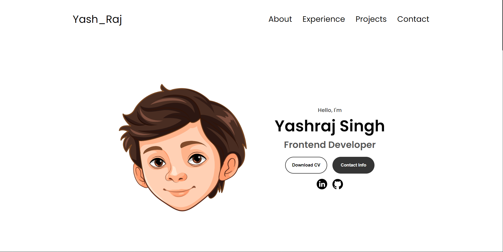

# Personal Portfolio Website

A personal portfolio website to showcase your projects, skills, and experiences. Built with HTML, CSS, and JavaScript, this responsive website is designed to provide a professional online presence.

## Features

- **Responsive Design:** Ensures the website looks great on all devices, including desktops, tablets, and mobile phones.
- **Project Showcase:** Highlights your projects with descriptions, images, and links.
- **Skills Section:** Displays your technical and soft skills.
- **About Section:** Provides a brief introduction about yourself.
- **Contact Form:** Allows visitors to get in touch with you directly through the website.
- **Smooth Scrolling:** Enhances the user experience with smooth scrolling between sections.

## Table of Contents

- [Demo](#demo)
- [Installation](#installation)
- [Usage](#usage)
- [Code Structure](#code-structure)
- [License](#license)
- [Contact](#contact)

## Demo


You can see a live demo of the Personal Portfolio Website [here](https://yashraj0888.github.io/Portfolio/).



## Installation

To get a local copy up and running, follow these simple steps:

1. Clone the repository:

    ```sh
    git clone https://github.com/Yashraj0888/Portfolio.git
    ```

2. Navigate to the project directory:

    ```sh
    cd Portfolio
    ```

3. Open `index.html` in your web browser to view the Personal Portfolio Website.

## Usage

1. Open `index.html` in any web browser.
2. Navigate through different sections to learn more about your projects, skills, and experiences.
3. Use the contact form to get in touch.

## Code Structure

- `index.html`: Contains the HTML structure of the Personal Portfolio Website.
- `style.css`: Contains the CSS for styling the Personal Portfolio Website.
- `script.js`: Contains the JavaScript for adding interactivity and enhancing user experience.


## License

Distributed under the MIT License. See `LICENSE` for more information.

## Contact

Yashraj - [LinkedIn ](https://www.linkedin.com/in/yashraj-singh-55804b253/) - yashraj88813@gmail.com

Project Link: [https://github.com/Yashraj0888/Portfolio/](https://github.com/Yashraj0888/Portfolio/)
